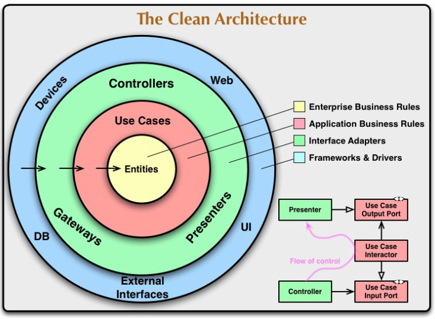
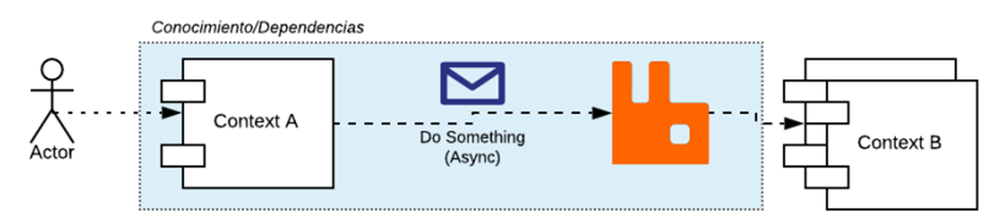
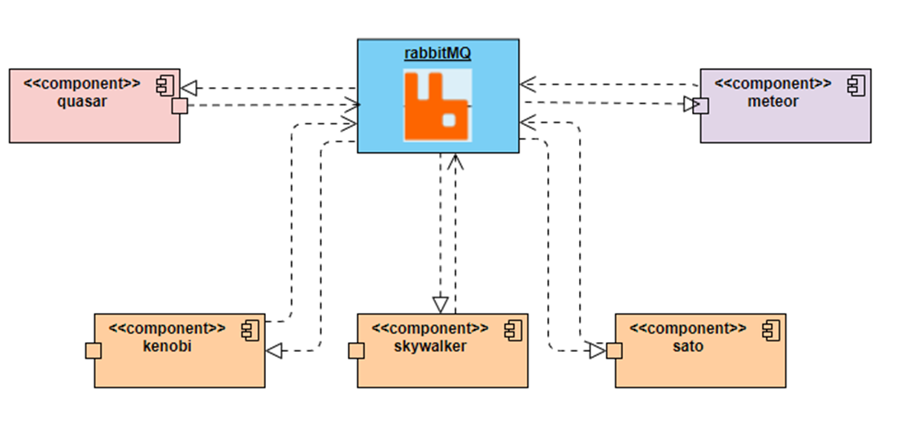
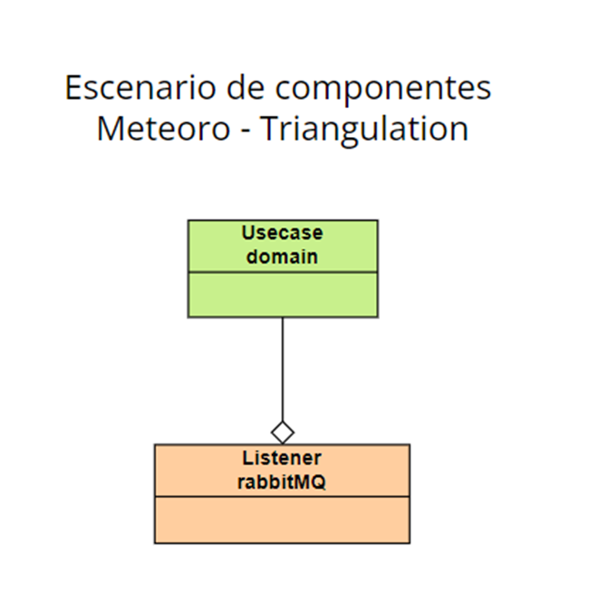
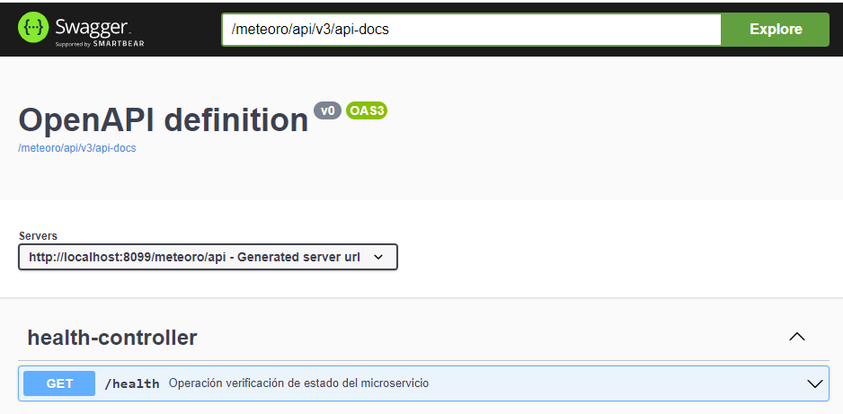

# meteoro: 
## Proyecto que triangula la posición de un objeto ## 

El presente proyecto fue creado bajo el diseño "Clean architecture" el cual permite un bajo acoplamiento entre los componentes asi:

fuente de referencia: https://medium.com/bancolombia-tech/clean-architecture-aislando-los-detalles-4f9530f35d7a

Las técnologías utilizadas fueron:

* Spring-boot
* RabbitMQ
* Swagger

# Diseño

A contianuación se ilustra el diseño de los componentes que conforman el microservicio teniendo en cuenta que posee caracteristicas reactivas debido a que es capaz de llamar a eventos expuestos en otros microservicios gracias al broker de mensajeria RabbitMQ con comunicación tipo Request/Reply:

La forma en que se comunica este microservicio con los demás es:

Explicación de los componente:

| Microservicio            | descripción                                                                                                                                                       | Repositorio | 
|--------------------------|-------------------------------------------------------------------------------------------------------------------------------------------------------------------|-------------| 
| meteor                   | Encargado de prestar el servicio de los cálculos de triangulación.                                                                                                | https://github.com/dveleper/meteoro            |

**RabbitMQ** es un broker de mensajería de código abierto, distribuido y escalable, que sirve como intermediario para la comunicación eficiente entre productores y consumidores. implementa el protocolo mensajería de capa de aplicación AMQP (Advanced Message Queueing Protocol), el cual está enfocado en la comunicación de mensajes asíncronos con garantía de entrega a través de confirmaciones de recepción de mensajes desde el broker al productor y desde los consumidores al broker.

**Diagrama de clases alto nivel:**

La documentación de las APIs con Swagger se puede visualizar al desplegar cada componente que posea servicios Rest expuestos:

Meteoro:
http://localhost:8099/meteoro/api/swagger-ui/index.html

